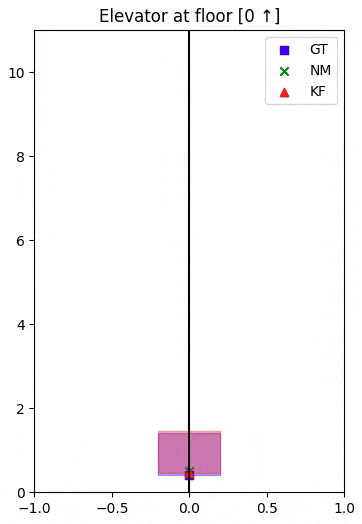

# Elevator Position Estimation Using 1D Kalman Filter

1D Kalman Filter for elevator position estimation. Includes data generation, kalman filter implementation using `filterpy` and my own, plus an animation with `matplotlib`. Everything is inside `main.ipynb`.

__Overview Video__

> *Developed for the Robotic Perception and Human-Robot Interaction 1 class at Toyohashi University of Tecnology, taught by Jun Miura sensei.*
